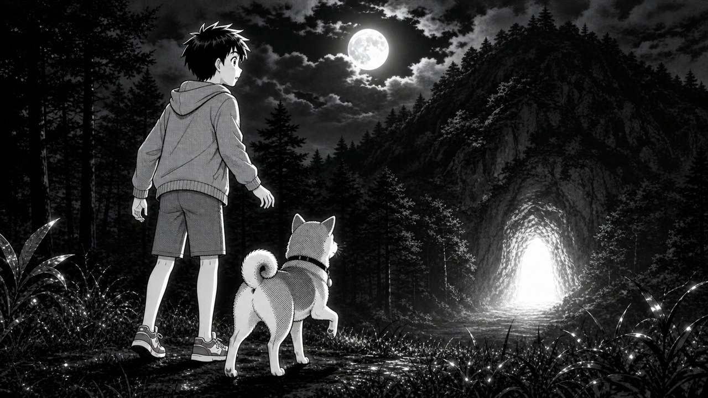

<!-- Sample chapter, adapted from a real run against a level-5 inventory
     (168 kanji known) with the protagonist renamed. Every kanji passed
     scripts/validate.py against that inventory; the four gloss-box words are
     the chapter's entire new-word budget. Three editions per chapter, printed separately: this learner page,
     the .furigana.md self-check edition, the .en.md answer key.

     The panel below was generated by scripts/illustrate.py from the series'
     cast pack (sample-cast-sheet.jpg is the locked reference model sheet —
     see characters/FORMAT.md). In real chapters the skill embeds the panel
     by ABSOLUTE path, because pandoc resolves images relative to the CWD. -->

---
toc: false
fontsize: 14pt
documentclass: extarticle
pagefooter: 夜の穴 その1
hyperrefoptions:
  - bookmarks=false
---

# 夜の穴 — その1「青い光」

{width=65%}

<!-- story -->
雨の夜だった。
ケンは十三才の男の子だ。小さい村にいる。
マルはケンの犬だ。大きくない。でも、力がある。
ケンはマルと、林の近くを走った。
すると、林の中から音がした。
「マル、今の音、何？」
「ワン！」
マルは林に入った。
「あ！マル！」
ケンも入った。
夜の林は、青かった。
林の中に、青い光が見えた。
光は、山の下の穴から出た。
雨は止まった。空に月が出た。
草の上に、古い石があった。四角で、白い。
石の上に字がある。
「王の宝は、この下にある。お金も、ある。」
「宝…！」
ケンは考えた。「王？この山の下に？」
ケンの心はドキドキした。
マルの耳が立った。
穴の中から、音がした。
大きい足の音だ。
音が近くなった。
ケンの体は、止まった。
「マル、走るよ！」
でも、マルは走らなかった。
マルは穴の口に立って、こう言った。
「ケン、入るよ。」
え？犬が言った？！

つづく

**Q:** つぎは？ A: マルと穴に入る / B: 村へ走る
<!-- /story -->

---
*このはなしは、きみがしっているかんじ168じだけでかかれている。*

\newpage

**ことば**（あたらしいことば）

| ことば | よみ | いみ |
|---|---|---|
| 男の子 | おとこのこ | boy |
| 青い | あおい | blue |
| 近く | ちかく | near, nearby |
| つづく | — | to be continued |

**つなぎことば**（ちいさいことば）

| ことば | いみ |
|---|---|
| 〜は | "as for …" (points at the topic) |
| 〜が | marks who/what does it |
| 〜を | marks what it's done to |
| 〜の | 's / of （ケンの犬 = Ken's dog） |
| 〜に | to, into |
| 〜で | in, at (where it happens) |
| 〜と | and, with |
| 〜も | too, also |
| 〜へ | toward, to |
| 〜から | from; because |
| 〜だ・だった | is ・ was |
| 〜た | (did — past) |
| 〜て | …and (links two actions) |
| 〜ない・なかった | not ・ didn't |
| でも | but |
| すると | just then… |
| 何 | what? |
| ある・いる | there is (thing ・ person/animal) |
| この | this ~ |
| こう | like this |
| 〜よ | ! (I'm telling you) |
| え？・あっ！ | huh?! ・ ah! |
| つぎ | next |
